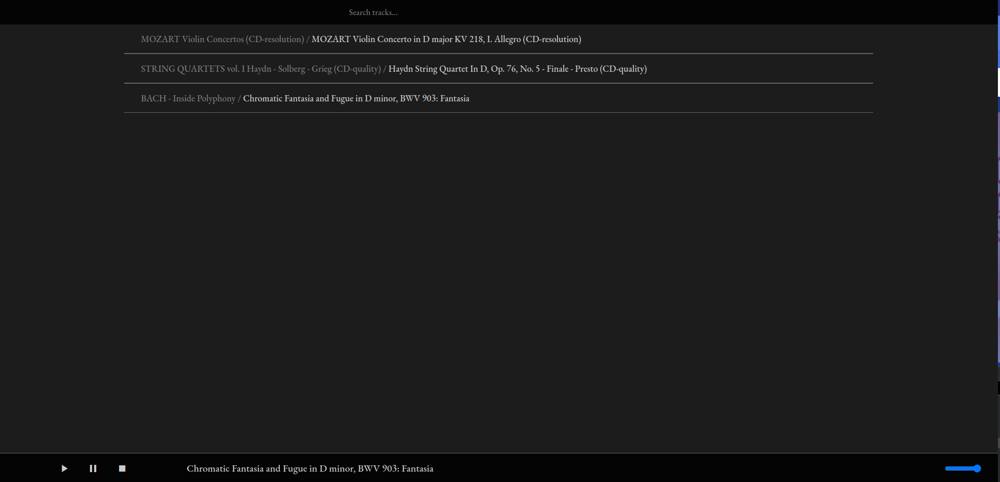

# Simple Play

*Simple Play* is a static website for audio streaming.

The goal is to provide audio streaming service with minimal setup/configuration, especially suitable
for streaming music over a LAN, allowing any device in the network to play the same track.

## Feature

- In browser audio playback
- Basic playback control: play, pause, stop, volume adjust
- Track searching
- Nothing more

## Dependencies

1. Any HTTP server
2. Python 3 with Mutagen (For indexing audio tracks)

## Setup

1. Set up a http web server. *Simple Play* requires a web server been set up, and can be served like
   any other static html website. For how to set up the server, refer to the documentation of your
   specific server software. Personally, I use `nginx`.
2. Upload your music to your server and place them in the same directory as the site (sub directory
   is allowed). For now the following formats are supported: `wav`, `flac`, `m4a`, `aac`, `ogg`
   , `webm`, `mp3`.
3. Run the included python script to index the uploaded audio files.

```shell
./music-index.py <directory of music files>
```

The script should search for and index every supported audio file in the given directory. If the
files has been tagged, the title name in the tag would be indexed, otherwise they would be indexed
with the file name.

This generates a `index.json` file in the directory, which will be used by the front end to load the
audio files.

4. Navigate to the site with your browser. You should be able to play you tracks now.

## Customization

The default interface of *Simple Play* is barebone and devoid of any style. However, if you know
some CSS, you can make it much better.

This is how it looks like as-is:


This is how it looks after my customization (not included in this repository):



More could be done, depending on how you would like it to be.
